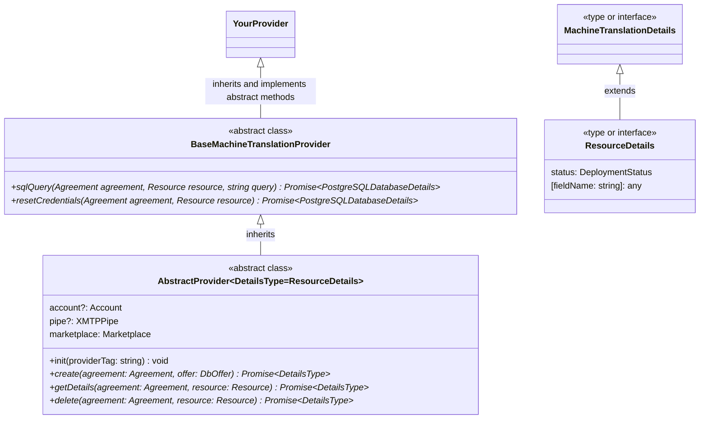

# Machine Translation

## Description

This product category aims to offer high quality translations from different languages pairs

## Basic Info

|                               |                                   |
| ----------------------------- | --------------------------------- |
| Software Stack / Service Type | `Machine Translation`             |
| Software Version (optional)   | `N/A`                             |
| PC Smart Contract Address     | `{SC Address}`                    |
| PC Registration Date          | `{Date of Registration}`          |
| PC Owner Website              | [link](https://{domain}/)         |
| PC Owner Contact Info         | [e-mail](mailto:owner@domain.com) |
| PC Owner Wallet Address       | `{Wallet Address}`                |

## Offer Specification

Each Offer in this Product Category must include the following properties:
|Name|Units|Description|
|-|-|-|
|API Version (optional)|`[v1, v2, v3]`|The version of the API requested by the client|
|API Key (optional)|`[services generated API key]`|The version of the API requested by the client|
|Region (optional, service endpoints)|`[Global(default), Americas, Asia Pacific, Europe eth.]`|The region from where the machine translation server will send translated text back.|

## Configuration Parameters [TODO]

This Product Category has the following configuration. These are enforced by the logic of the on-chain smart contract.
| | |  
|----------------|-------------------------------|
|Maximum Number of Validators|`{maxNumValidators}`|
|Maximum Number of Providers|`{maxNumProviders}`|
|Validator Registration Fee|`{valRegistrationFee}` FOREST tokens|
|Provider Registration Fee|`{provRegistrationFee}` FOREST tokens|
|Resource Registration Fee|`{resourceRegistrationFee}` FOREST tokens|
|Update Delay for Terms Change|`{termsUpdateDelay}` blocks|
|Validators Share of Emissions|`{rewardsSplit_validators}` %|
|Providers Share of Emissions|`{rewardsSplit_providers}` %|
|PC Owner Share of Emissions|`{rewardsSplit_pcOwner}` %|
|Performance Optimization Weight |`{opWeight_performance}`%|
|Price Optimization Weight|`{opWeight_price}`%|
|Price-to-Performance Optimization Weight|`{opWeight_ptp}`%|
|Popularity Optimization Weight|`{opWeight_popularity}`%|
|Hash of the Details File|`{CID}`|

You can always double-check the on-chain values e.g. [here](https://etherscan.io/address/{SC Address}#readContract)

## Tests and Quality Thresholds [TODO]

The Validators are performing a number of tests on Resources to ensure quality across the board. Below is a list of checked Benchmarks:
|Name|Units| Threshold Value| Min / Max|  
|-|-|-|-|
|{Test Name 1}|`{Units}`|`{Value}`|{Min / Max}|
|{Test Name 2}|`{Units}`|`{Value}`|{Min / Max}|
|{Test Name 3}|`{Units}`|`{Value}`|{Min / Max}|
...

More in-depth descriptions of the Tests:
|Name|Description|  
|-|-|
|{Test Name 1}|{Long form description}|
|{Test Name 2}|{Long form description}|
|{Test Name 3}|{Long form description}|
...

## Become a Provider

#### Step-by-step instructions

In order to start providing services for this Product Category you need to:

1. Create a Provider class that inherits from `BaseMachineTranslationProvider` and implement all of the abstract methods (take a look at the diagram below for more information).
2. Enable that Provider class by adding it inside `providers` object inside `src/index.ts` (by default only one provider enabled in the daemon, named `main`)
3. Define information about the Provider inside `data/providers.json`. You can refer to `data/providers.json.example`.
4. Install Forest Protocols CLI by following these instructions: [link](https://github.com/forest-protocols/cli....)
5. Using the CLI register in the Protocol as a Provider:
   - `TODO: Write related CLI commands`
6. Using the CLI register in this Product Category:
   - `TODO: Write related CLI commands`
7. Run the Provider daemon.
8. Using the CLI register your offers on-chain and Provider's database:
   - `TODO: Write related CLI commands`

#### Provider Class Hierarchy

Your Provider class must inherit from this Product Category's base Provider class, `BasePostgreSQLDatabaseProvider`. This class design unifies the way all Providers, Users and Validators communicate.

## Become a Validator [TODO]

#### Step-by-step instructions

In order to start providing validation services for this Product Category you need to:

1. Run your Validator Node based on the code from this repository. Detailed instructions here: [link](https://github.com/this_repo/validator/README.md)
2. Install a Forest Protocols CLI by following these instructions: [link](https://github.com/forest-protocols/cli....)
3. Using the CLI register in the Protocol as a Validator:
   a. `command 1`
   b. `command 2`
4. Using the CLI register in our Product Category:
   a. `command 1`
   b. `command 2`
